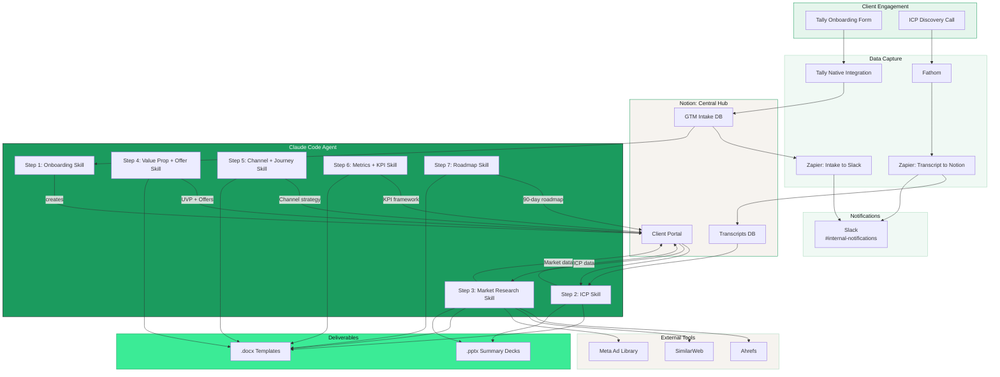
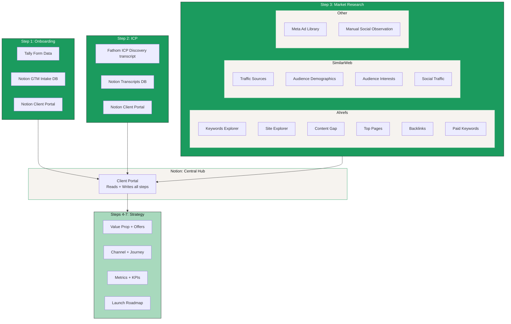
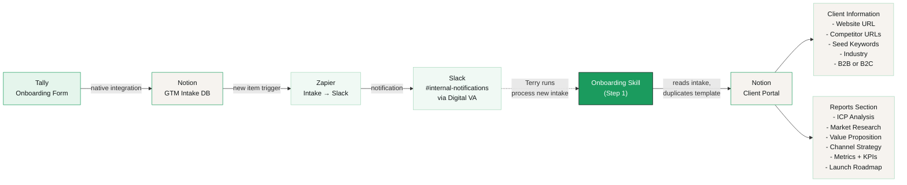

# ClearLaunch System Diagrams

Visual diagrams of the ClearLaunch GTM System architecture and data flow. These render automatically on GitHub.

---

## System Architecture

How data flows from client engagement through the agent to deliverables:

---

## Step-by-Step Data Flow

Each step's output becomes the next step's input. Notion is the hub that connects them all:

```mermaid
flowchart LR
    S1["Step 1\nOnboarding"]
    S2["Step 2\nICP"]
    S3["Step 3\nMarket Research"]
    S4["Step 4\nValue Prop + Offers"]
    S5["Step 5\nChannel + Journey"]
    S6["Step 6\nMetrics + KPIs"]
    S7["Step 7\nLaunch Roadmap"]
    S1 -->|"Client Portal\ncreated"| S2
    S2 -->|"pain points, competitors,\nsegments, industry"| S3
    S3 -->|"keywords, gaps,\naudience data"| S4
    S4 -->|"positioning, messaging,\noffer structure"| S5
    S5 -->|"channels, journey,\nbudget allocation"| S6
    S6 -->|"KPIs, baselines,\nmeasurement cadence"| S7
    T0["Tally Form\n+ Notion GTM Intake"]
    T1["Fathom + Notion"]
    T2["Ahrefs + SimilarWeb\n+ Meta Ad Library"]
    T0 -.->|form data| S1
    T1 -.->|ICP Discovery\ntranscript| S2
    T2 -.->|browser data| S3
    style S1 fill:#1B9B5E,stroke:#121718,color:#fff
    style S2 fill:#1B9B5E,stroke:#121718,color:#fff
    style S3 fill:#1B9B5E,stroke:#121718,color:#fff
    style S4 fill:#A8D9BD,stroke:#121718,color:#121718
    style S5 fill:#A8D9BD,stroke:#121718,color:#121718
    style S6 fill:#A8D9BD,stroke:#121718,color:#121718
    style S7 fill:#A8D9BD,stroke:#121718,color:#121718
    style T0 fill:#F0F9F4,stroke:#A8D9BD,color:#121718
    style T1 fill:#F0F9F4,stroke:#A8D9BD,color:#121718
    style T2 fill:#F0F9F4,stroke:#A8D9BD,color:#121718
```

**Legend:**
- **Dark green nodes** = built (Steps 1-3)
- **Light green nodes** = not yet built (Steps 4-7)
- **Solid arrows** = data handoffs between steps
- **Dotted arrows** = external tool inputs

---

## Tool Responsibility Map

Which tools serve which steps and what data they provide:

---

## Onboarding Flow

The upstream automation that creates the client portal before any skills run:

